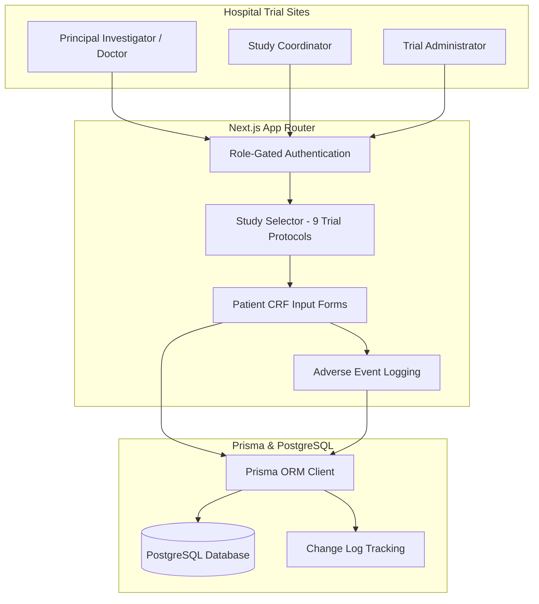

# Helix Pharma Clinical Report Form (CRF) Portal

Systems architecture and implementation case study for the centralized **Clinical Report Form (CRF)** data capture portal built for **Helix Pharma** across 9 clinical drug trials in Pakistan.

---

## Role & Scope

* **Role:** Full-Stack Developer (Team Project)
* **Context:** Built under Softsols Pakistan for Helix Pharma clinical study coordinators.
* **Scope of Ownership:** Contributed to the Next.js and Prisma web portal: structured multi-study database schemas, built role-gated clinical input forms (baseline exams, follow-ups, adverse event logs), and implemented patient consent modules.

---

## System Flow

---

## Technical Highlights

* **Multi-Study Protocol Schemas:** Structured relational data models with Prisma to isolate patient visits, lab values, and symptom scores across 9 distinct clinical trials.
* **Clinical Input Validation:** Built form validation rules to ensure required medical observations, vital signs, and medication dosages are accurately entered before submission.
* **Adverse Event Logging:** Implemented structured tracking for reporting unexpected clinical events, severity gradings, and follow-up resolutions.
* **Role-Based Access Control:** Structured role boundaries separating hospital site coordinators, attending physicians, and administrative auditors.

---

## Tech Stack

* **Frontend & Backend:** Next.js (App Router, Server Actions), React
* **Language:** TypeScript
* **ORM & Database:** Prisma ORM, PostgreSQL
* **Styling:** Tailwind CSS

---

## Notice

Clinical trial protocols, patient personal health information, and proprietary drug datasets belong strictly to Helix Pharma and Softsols Pakistan. This repository documents system architecture and software specifications.
