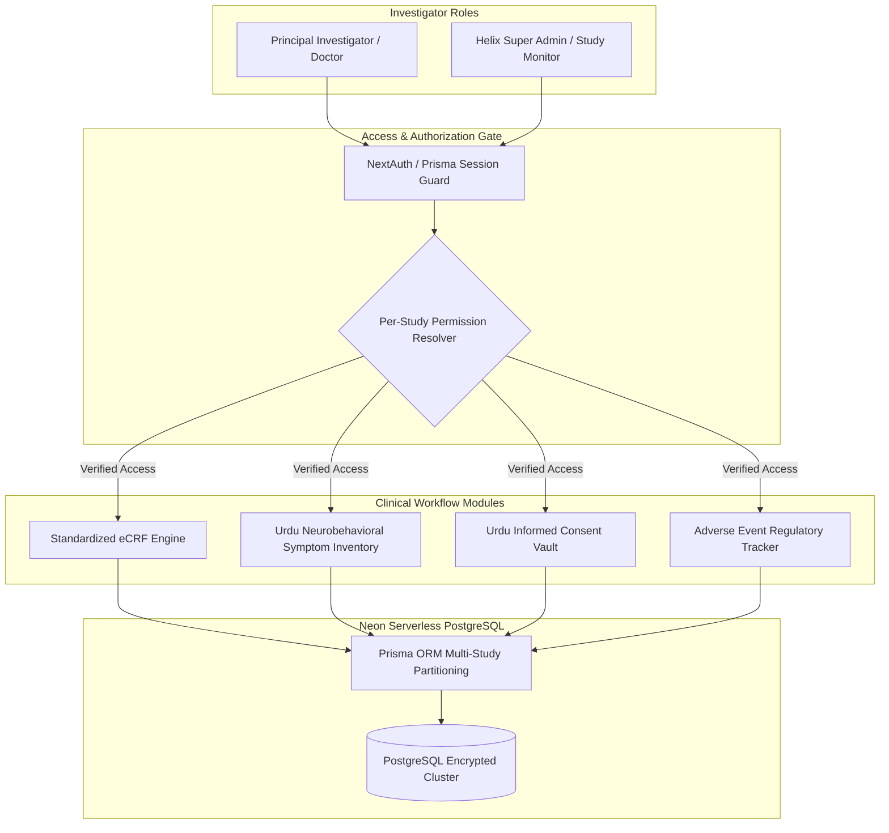

# 💊 Helix Pharma CRF Portal — Clinical Trials Monitoring Architecture

[-000000?style=for-the-badge&logo=nextdotjs&logoColor=white)]()
[]()
[-4169E1?style=for-the-badge&logo=postgresql&logoColor=white)]()
[]()
[]()

> **Clinical Research Notice & Regulatory Disclaimer**:  
> Engineered for **Helix Pharma** via **Softsols Pakistan**.  
> Patient personal health data, confidential clinical study protocols, and institutional trial investigator details are strictly confidential. This repository documents the multi-study data modeling, role-based investigator permissions, and localized patient consent architecture.

---

## 🏛️ System Overview: 9 Concurrent National Clinical Trials

The **Helix Pharma CRF Portal** is an enterprise regulatory platform designed to collect, validate, and monitor patient Clinical Report Forms (CRF) across **9 major pharmaceutical drug trials** in Pakistan:

1. **BRAVO** & **BRAVE-ERA:** Neurological intervention studies.
2. **BOSS:** Clinical efficacy evaluation.
3. **MOTION** & **MEND:** Post-market observational surveillance.
4. **ENGAGE** & **RESET:** Behavioral and therapeutic response tracking.
5. **BRILLIANT:** Multicenter comparative trial.
6. **BST (Brivaracetam Supratentorial Tumor):** High-stakes oncological-neurology investigation.



---

## 🛠️ Core Engineering Highlights

### 1. Multi-Study Schema Partitioning (`Prisma ORM` + `PostgreSQL`)
* **The Architecture Challenge:** Each of the 9 clinical studies follows distinct clinical inclusion/exclusion criteria, varying baseline physical exams, and differing visit intervals (Day 0, Day 7, Day 30, Day 90).
* **The Engineering Solution:** Designed a multi-tenant relational schema where each patient record and CRF submission strictly binds to a `StudyProtocol` entity. Doctors are assigned granular, per-study investigator rights, preventing cross-study data contamination.

### 2. Native Urdu Localization for Clinical Compliance
* Medical ethics and regulatory standards in Pakistan mandate that informed consent and patient-reported symptoms are accessible in the national language.
* Engineered dedicated bilingual data models storing both UTF-8 Urdu script and English transcriptions for:
  * **Patient Informed Consent Forms**
  * **Neurobehavioral Symptom Inventory (NSI)** entries for neurological assessments.

### 3. Real-Time Adverse Event (AE) Audit Trail
* Implemented strict audit-logging middleware recording timestamped investigator signatures upon any modification to patient vitals or adverse event reports, complying with clinical Good Clinical Practice (GCP) requirements.

---

## 📁 Repository Structure

```
helix-crf-clinical-trials/
├── snippets/
│   └── schema-partitioning.prisma    # Multi-study partitioned database model
├── README.md                         # Master clinical architecture whitepaper
└── LICENSE                           # MIT License
```

---

## 📄 License
Documented and published under the [MIT License](LICENSE).
