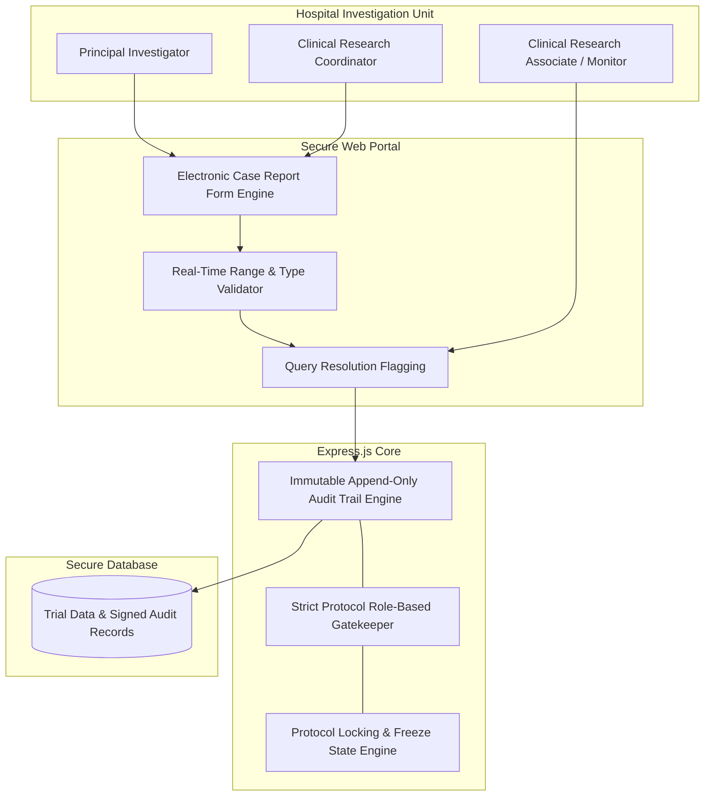

# Helix Pharma Clinical Report Form (CRF) & Clinical Trial Engine

Systems architecture and engineering case study for the multi-center **Electronic Data Capture (EDC) & Case Report Form (CRF)** system deployed for **Helix Pharma** across 9 national Phase III/IV clinical trials.

---

## Role & Ownership

* **Role:** Full-Stack Clinical Systems Developer
* **Context:** Built under Softsols Pakistan for Helix Pharma clinical research teams.
* **Scope of Ownership:** Append-only cryptographic audit trail, role-based investigator form access controls, and GCP-compliant data validation pipelines.

---

## Architecture Pipeline

---

## Core Technical Highlights

* **Immutable Audit Trail:** Compliant with Good Clinical Practice (GCP) and FDA 21 CFR Part 11; records user identity, UTC timestamps, previous values, and medical justifications for any modifications to patient trial data.
* **Multi-Center Form Engine:** Configurable CRF templates capturing adverse event (AE) reporting, drug dosing schedules, and laboratory bio-markers across 9 national trial sites.
* **Query Resolution Workflow:** Integrated flag-and-resolve workflow allowing clinical monitors to challenge ambiguous values and investigators to document clarifying addenda.
* **Data Lock & Archival:** Cryptographic site-freezing protocols ensuring complete dataset immutability prior to statistical analysis.

---

## Tech Stack

* **Frontend:** Next.js, React, Tailwind CSS
* **Backend:** Node.js, Express.js REST API
* **Database:** MongoDB with write-locked audit collections
* **Standards:** GCP, ICH E6(R2), FDA 21 CFR Part 11 guidelines

---

## Notice

Proprietary clinical trial protocols, patient subject identities, and drug efficacy datasets belong to Helix Pharma and Softsols Pakistan. This repository documents software architecture and audit compliance specifications.
